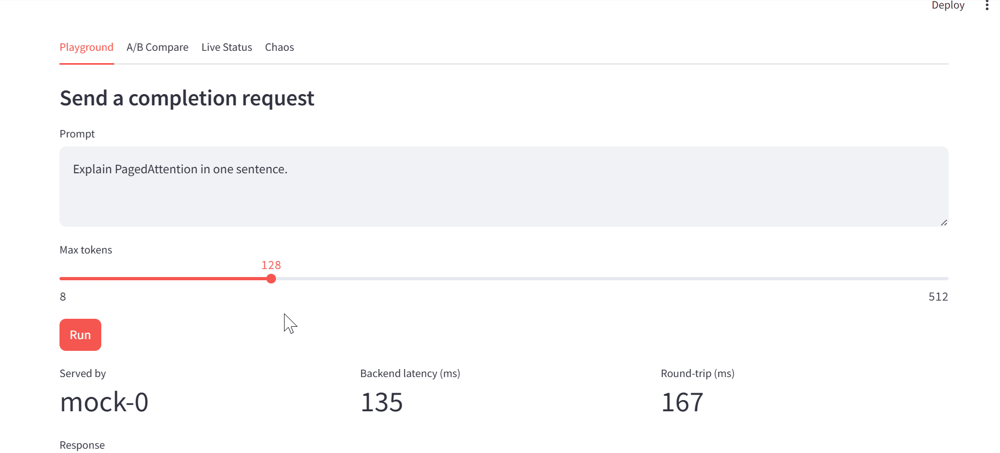

# InferMesh

A self-hosted, horizontally scalable LLM inference platform: a load-balancing
gateway in front of multiple model replicas, a Kafka-based event/metrics
pipeline, Kubernetes deployment with autoscaling and chaos-tested reliability,
a load/eval harness, and a Streamlit control room for live demoing.

InferMesh is the *serving infrastructure* layer that a system like
[InfraAgent-911](#) would sit on top of; this repo focuses purely on making
LLM inference fast, observable, and resilient at scale, independent of any
single application.

## Demo


## Why this exists

Most "LLM project" portfolios are a notebook that calls an API. InferMesh is
the opposite: the model is the least interesting part. What's being tested
here is everything *around* the model: routing, backpressure, autoscaling,
graceful degradation, and measurable optimization tradeoffs.

## Architecture
                    ┌─────────────────┐
                    │   Streamlit     │
                    │  Control Room   │
                    └────────┬────────┘
                             │ HTTP
                    ┌────────▼────────┐
                    │     Gateway     │  FastAPI
                    │  (LB, retries,  │
                    │ circuit breaker)│
                    └───┬────────┬────┘
             ┌──────────┘        └──────────┐
    ┌────────▼────────┐          ┌──────────▼───────┐
    │ Model Replica 1  │          │ Model Replica 2  │
    │ (vLLM / llama.cpp│          │ (vLLM / llama.cpp│
    │  / mock backend) │          │  / mock backend) │
    └────────┬─────────┘          └──────────┬───────┘
             │      every request emits an event
             └───────────────┬───────────────┘
                    ┌────────▼────────┐
                    │   Kafka topic:  │
                    │ inference.events│
                    └────────┬────────┘
                    ┌────────▼────────┐
                    │ Metrics Consumer │──▶ Prometheus ──▶ Grafana
                    └─────────────────┘

Full diagram source: [`docs/diagrams/architecture.md`](docs/diagrams/architecture.md).
Design rationale and tradeoffs: [`docs/DESIGN.md`](docs/DESIGN.md).

## Repo layout

| Path | Purpose |
|---|---|
| `gateway/` | FastAPI load-balancing gateway: routing, retries, circuit breaking |
| `serving/` | Model backend adapters (vLLM, llama.cpp, mock) behind one interface |
| `kafka/` | Producer (embedded in gateway) and consumer that aggregates metrics |
| `k8s/helm/infermesh/` | Helm chart: deployments, HPA, probes, PDBs |
| `observability/` | Prometheus scrape config + Grafana dashboards |
| `eval/` | Eval harness: deterministic substring checks per case (`eval/harness.py`), plus rubric fields for future judge-based scoring (not yet implemented — see `docs/ROADMAP.md`) |
| `loadtest/` | Locust load test scenarios |
| `chaos/` | Scripts that kill replicas / inject latency, with observed-behavior writeups |
| `streamlit_app/` | Control room UI: playground, live metrics, A/B compare, chaos button |
| `docs/BENCHMARKS.md` | Optimization log: baseline → change → measured result |
| `docs/SLO.md` | Declared SLOs and whether the system meets them |

## Quickstart (local dev, no GPU required)

```bash
docker compose -f docker/docker-compose.yml up --build
```

This starts: gateway (2 mock model replicas by default), Kafka + Zookeeper,
the metrics consumer, Prometheus, Grafana, and the Streamlit control room at
`http://localhost:8501`.

To point at a real model instead of the mock backend, set `MODEL_BACKEND=vllm`
(GPU) or `MODEL_BACKEND=llama_cpp` (CPU) and `REPLICA_ENDPOINTS=...`. Setup
guides:
- [`docs/LOCAL_CPU_SETUP.md`](docs/LOCAL_CPU_SETUP.md) — llama.cpp on a laptop
  with no dedicated GPU (no CUDA required)
- [`docs/LOCAL_GPU_SETUP.md`](docs/LOCAL_GPU_SETUP.md) — vLLM on a local
  NVIDIA GPU (Windows users: see the WSL2 note in that doc — vLLM doesn't
  support native Windows)
- [`docs/HPC_SETUP.md`](docs/HPC_SETUP.md) — secondary option only; school
  HPC access here is partial and doesn't allow installing software

## Status

All six planned phases are complete, each with a real, live-verified
result — not just working code. Full detail in
[`docs/ROADMAP.md`](docs/ROADMAP.md); the short version:

- **Phase 0** — scaffold, CI, mock backend, chaos-tested reliability
  (5/5 requests survived a killed replica)
- **Phase 1** — real vLLM serving on a local GPU; two real upstream bugs
  diagnosed and fixed along the way (a WSL2-specific CUDA bug, a missing
  CUDA toolkit), documented in [`docs/LOCAL_GPU_SETUP.md`](docs/LOCAL_GPU_SETUP.md)
- **Phase 2** — Prometheus metrics (live router-state collector, not
  hand-synced gauges) and an auto-provisioned Grafana dashboard, verified
  running
- **Phase 3** — deployed to a real Kubernetes cluster (minikube):
  **40/40 requests survived an actual pod deletion**, and the
  PodDisruptionBudget's enforcement was proven with a real Kubernetes
  eviction error, not just a config that looks right
  (see [`chaos/RESULTS.md`](chaos/RESULTS.md))
- **Phase 4** — a second, independent Kafka consumer proving the event
  pipeline is genuinely pub-sub decoupled: 10/10 events matched across
  two separate consumer groups from one real request burst
- **Phase 5** — real load testing (Locust): zero failures across a
  1-100 user concurrency sweep, and a burst test proving the router's
  backpressure path actually works — 45% of requests correctly rejected
  under deliberate overload (see [`docs/BENCHMARKS.md`](docs/BENCHMARKS.md))
- **Phase 6** — an eval harness with a regression case tied directly to
  a real wrong answer a live model gave in Phase 1, wired into CI; SLOs
  filled in with real measured numbers instead of placeholders
  (see [`docs/SLO.md`](docs/SLO.md))

Several real bugs were found and fixed along the way rather than
designed around in advance — including a Kafka consumer that crash-looped
on startup-ordering races (fixed with retry-with-backoff, tested in
`tests/test_kafka_consumer_retry.py`) and a load-test bug that silently
masked the exact behavior it was meant to measure. Both are documented
where they happened, not smoothed over.

## License

MIT
