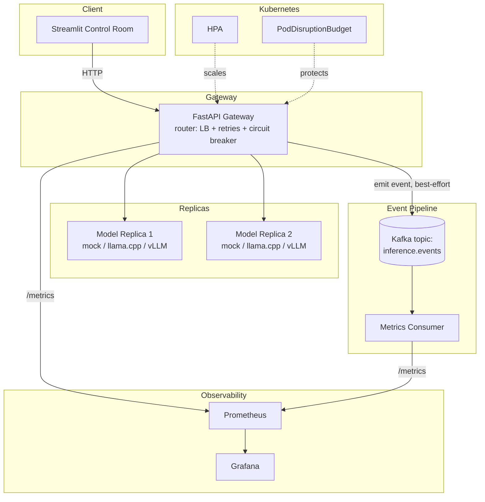

# Architecture Diagram

GitHub renders Mermaid natively in Markdown — no image export needed.

## Request flow (happy path)

1. Streamlit (or any client) posts a prompt to the gateway's
   `/v1/completions`.
2. The router picks the replica with the fewest in-flight requests among
   healthy ones.
3. On failure, the router retries once against a different replica; three
   consecutive failures on a replica trips its circuit breaker for a
   cooldown window.
4. The completion result is returned to the client, and — independently,
   best-effort — an event is emitted to Kafka.
5. The metrics consumer aggregates events into Prometheus metrics;
   Grafana reads from Prometheus.

## Failure mode this diagram is meant to make obvious

If Kafka is down, the request path (client → gateway → replica → client)
is completely unaffected — only the dotted-line observability path
degrades. This is verified in practice, not just claimed: see the gateway
startup log in `chaos/RESULTS.md`'s Phase 0 notes.
